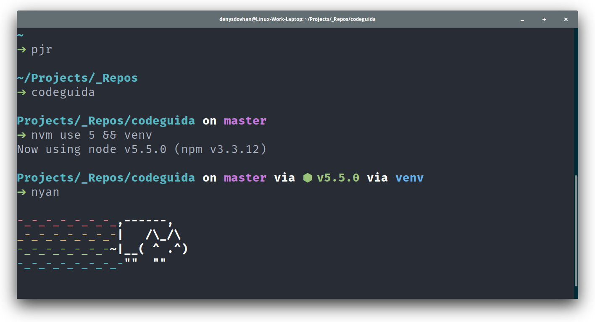

# Denys Dovhan’s dotfiles

This is my dotfiles for Ubuntu or something else that supports Bash, like Mac, Elementary OS and etc.



# Installation

If you want to install my dotfiles on your machine, just copy this command and execute in the terminal:

```bash
wget -O - https://raw.githubusercontent.com/denysdovhan/dotfiles/master/installer.sh | bash
```

You can tell Git who you are using these commands:

```
git config -f ~/.gitlocal user.email "email@yoursite.com"
git config -f ~/.gitlocal user.name "Name Lastname"
```

# Updating

For updating dotfiles, just execute command bellow:

```
dotfiles
```

# Features

* Colorful and clever Bash prompt, useful aliases, [etc](./docs/BASH.md).
* Git config, global ignore file and aliases.
* Dotfiles syncronization (`sync.py`).
* Highlighting repository's Git status.
* Highlighting current virtual environment.
* Color conversion script: convert #HEX to RGB/RGBA and HSL/HSLA.
* Changelog generator.
* Script for adding spaces to [Plank Dock](http://wiki.go-docky.com/?title=Plank:Introduction).
* Dotfiles, System, Gems and NPM update script.
* Useful helpers (`helpers/`).
* And to many [other](./docs/BASH.md).

# Notes

* You can use any file extensions in `tilde/` to invoke proper syntax highlighting in code editor.
* Add your Bash profile customization to `~/.bash_extra`.
* Add your git user data and custom settings to `~/.gitlocal`.
* Fort this repo and make it better!

# Docs

For more informations see [docs](./docs):

* [BASH docs](./docs/BASH.md).
* [GIT docs](./docs/GIT.md).

# TODO

Roadmap for `v1.0`:

* [ ] Migrate on `zsh`.
* [ ] Get rid of required ssh for installation.
* [ ] Migrate to [npm-check-updates](https://www.npmjs.com/package/npm-check-updates).
* [ ] Add `~/.atom` files.
- [ ] Add **Sublime Text** installer
- [ ] Update node.js [instalation](https://nodesource.com/blog/nodejs-v012-iojs-and-the-nodesource-linux-repositories)
- [ ] Remove `_Sites`

# Resources

Resources that I used in my dotfiles:

* [GitHub ❤ ~/](http://dotfiles.github.com/)
* [Artem Sapegin’s dotfiles](https://github.com/sapegin/dotfiles)
* [Mathias’s dotfiles](https://github.com/mathiasbynens/dotfiles)
* [Yet another cool story about bash prompt](http://habrahabr.ru/company/mailru/blog/145008/)

---

Be kitten :smiley_cat: .
